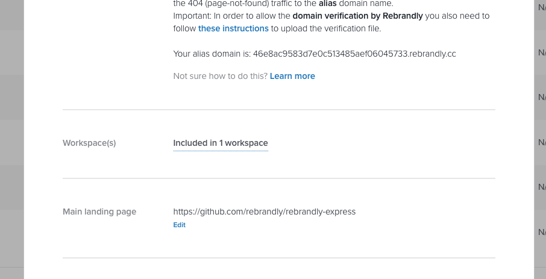
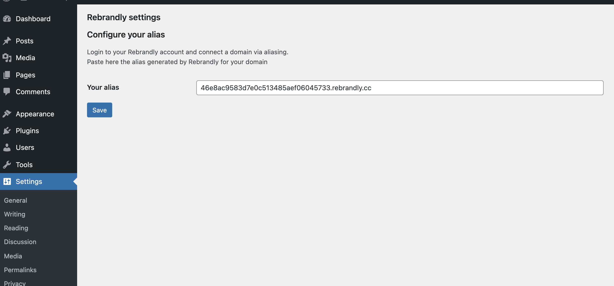

By installing this plugin and configuring it to connect with your Rebrandly account,  
you will be able to create branded links using the same domain your Wordpress application makes use of.

Unlock the opportunity for your team to freely create branded links via Rebrandly,
while still safely serving your own content from your WordPress application.

Here are a few steps necessary to use this:

1. Install the plugin in your Wordpress
2. Connect the domain to Rebrandly as Alias Domain, and take note of the autogenerated value for the alias
3. Set the alias name in the Admin menu (Settings > Rebrandly) and Save your settings

  
  
  
    

